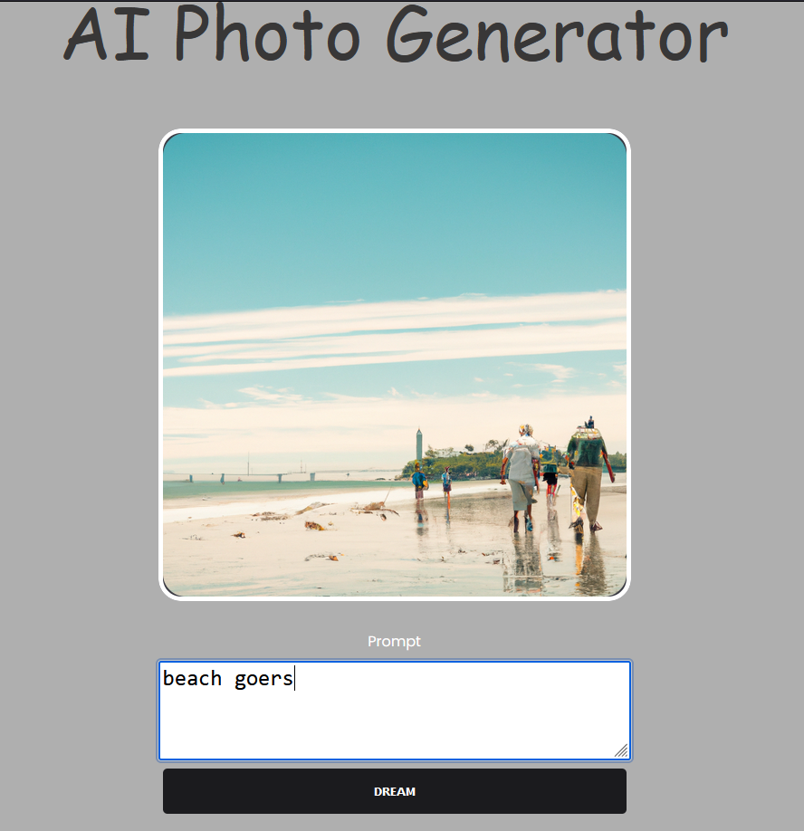

## About Me
As a Full-Stack Developer and Data Engineer with a focus on IT Product Management, I strive to leverage innovative technologies to enhance healthcare and financial solutions. Proficient in data modeling, interactive visualization, and web development, I aim to combine my technical expertise with strong interpersonal skills to empower data-driven decision-making processes.

### OpenAI's Image Generator
Here I connect to OpenAi's api in NodeJS/Javascript and allow users to enter prompt to display images.

[Link to Repo](https://github.com/KyleMChambers/gpt_image_search)

### TensorFlow project
Predicting the winning features of the National Basketball Association (NBA) using a sklearn decison trees. Using data from basketball reference, we iterate over our dataframe and create winsteak and last home win features and apply it in a decison tree. This uses NumPy, Pandas, sklearn.

[Link to repository](https://github.com/KyleMChambers/NbaPredict/blob/main/nba_predict.py)

### Vanilla JS game
Javascript two player Roll or Hold dice game.

### Twitter/X api and analysis of accounts
An analysis of the ESPN NFL Insider Adam Schefter's twitter account using Python's Tweepy. 3400 tweets between June 2019-February 2020. The link to the visual below allows you to interact with the visual, filter on favorites and retweets.

[Link to tableau visual](https://public.tableau.com/app/profile/kyle.chambers/viz/AdamSchefterTweets/Dashboard1)

### Using matlabs in Python
Using Python to analyze NFL team conversion success on 3rd and 4th down conversions in Jupyter Notebook. We will look at the top converters as well as the league win totals.

[NFL Conversion Analysis](https://github.com/MyFriendKMC/Conversions/blob/master/NFL_conversions.ipynb)

### Analyzing my own Spotify account
Connecting to Spotify's API using python's Spotipy and analyzing the top 50 songs on my own account. Here we look at top songs and popularity rating, as well as song length and  number of records over the course of 6 weeks.

[Link to repository](https://github.com/myfriendkmc/spotify) 

[Link to tableau visual](https://public.tableau.com/app/profile/kyle.chambers/viz/MyTopSpotifyArtists/MyTopSpotifyArtists)

### Contact Me
[Kyle.Chambers13@outlook.com](mailto:kyle.chambers13@outlook.com) |
[Linkedin](https://www.linkedin.com/in/kylemchambers/) |
[Github](https://github.com/KyleMChambers) |
[My Tableau Public Profile](https://public.tableau.com/profile/kyle.chambers)

